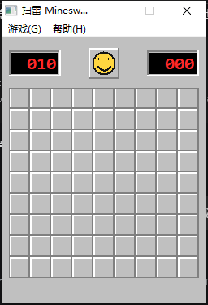
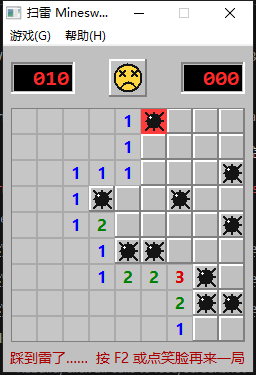

用Deepseek-flash写的一个扫雷，用了约3M token，好在缓存命中99%，大约是0.7元左右吧
除了这几句话，其他全部由Deepseek-flash编写，测试。
*快去下载Deepseek Harness，这几天送6块*
补一张图片（开局的）：


---

# 扫雷 Minesweeper

> 发起者：**Liu_Yuxun** ｜ 实现：**DeepSeek-flash**

用 C++17 从零手写的扫雷，**零第三方依赖**。图形版直接调 Win32 + GDI，控制台版只用标准库；没有 `.rc` 资源文件，菜单栏、字体、图标、笑脸全部由代码绘制，每个版本都是一个 `.cpp` 文件。



> 截图是失败状态：踩中的那颗雷红色高亮，其余雷全部显示，笑脸变成叉眼苦脸，底部状态条给出提示。

> ⚠️ **运行验证范围（重要）**：这个项目**只在发起者本人的一台电脑上编译并运行成功过**：
>
> - 操作系统：Microsoft Windows 10 Pro（版本 10.0.19045，AMD64）
> - 编译器：g++ 15.2.0（MinGW-w64，x86_64）
> - 除上述环境外，**其他任何环境都没有试验过**：MSVC、clang、32 位、ARM、Windows 7/8 实机、其他版本的 MinGW，全部未验证。
>
> 所以换一台电脑、换一个编译器出现编译失败或运行异常，是完全可能的情况。`win7-win8/` 里的适配代码只是按资料改出来的，发起者没有老系统可以实测。

## 两个版本

| 源码 | 版本 | 界面 | 适合 |
| --- | --- | --- | --- |
| `minesweeper_gui.cpp` | **图形版** | Win32 原生窗口，鼠标操作 | 日常玩 |
| `minesweeper.cpp` | 控制台版 | 文本 + ANSI 彩色 | 终端党 / 看算法 |
| `win7-win8/` | 图形版（老系统） | 同图形版 | Windows 7 / 8 |

## 快速开始

### 方式一：用编译好的 exe

从本仓库的 [Releases](../../releases) 下载 `minesweeper_gui.exe`。它是**单文件绿色版**，C++ 运行时已经静态链接进去，拷到任何 Windows 10 / 11 (x64) 上双击就能玩，对方不需要装编译器或任何运行库。

（仓库里没有 Release 的话，直接双击 `build.bat` 自己编一个，大概 30 秒。）

### 方式二：自己编译

双击 `build.bat`，它会自动查找 `g++ / clang++ / MSVC`，把两个版本都编译出来，然后问你要运行哪一个。

手动编译：

```bat
:: 图形版 (MinGW / g++)，-static 系列保证不依赖 libstdc++-6.dll 等运行时
g++ -std=c++17 -O2 -mwindows -static -static-libgcc -static-libstdc++ ^
    -o minesweeper_gui.exe minesweeper_gui.cpp -lgdi32 -luser32

:: 图形版 (MSVC)，/MT 静态链接运行时
cl /nologo /std:c++17 /utf-8 /EHsc /MT /O2 /DUNICODE /D_UNICODE ^
   /Fe:minesweeper_gui.exe minesweeper_gui.cpp user32.lib gdi32.lib ^
   /link /SUBSYSTEM:WINDOWS

:: 控制台版
g++ -std=c++17 -O2 -static -static-libgcc -static-libstdc++ -o minesweeper.exe minesweeper.cpp
```

## 玩法

### 图形版

| 操作 | 作用 |
| --- | --- |
| 左键点击 | 翻开格子 |
| 右键点击 | 插旗 / 取消旗 |
| 中键点击 | 快速展开（chord） |
| 左键点已翻开的数字 | 周围旗数够时一键展开 |
| 笑脸按钮 / `F2` | 重开一局 |
| 菜单「游戏」 | 切换初级 / 中级 / 高级，或退出 |
| 菜单「帮助」 | 操作说明 |

**界面元素**：左右两个红色 LED 数字框分别是**剩余雷数**和**用时秒数**；中间笑脸随状态变化（正常微笑 / 按下时张嘴 / 胜利戴墨镜 / 失败叉眼苦脸）；踩中的那颗雷红色高亮；游戏结束后底部状态条显示胜负提示。

### 控制台版

| 输入 | 作用 |
| --- | --- |
| `A1` | 翻开 A 列第 1 行 |
| `FA1` 或 `F A1` | 插旗 / 取消旗 |
| 对已翻开的数字再输入一次坐标 | 快速展开 |
| `N` / `R` | 重开本难度 |
| `H` / `?` | 帮助 |
| `Q` | 退出 |

启动参数可以直接指定难度：`minesweeper.exe 3` 进高级。

## 难度

| 名称 | 棋盘 | 雷数 |
| --- | --- | --- |
| 初级 Beginner | 9×9 | 10 |
| 中级 Intermediate | 16×16 | 40 |
| 高级 Expert | 30×16 | 99 |

## 实现要点

- **首点保护**：第一次点击的格子及其周围 8 格保证无雷，不会一开局就死。
- **迭代式洪水填充**：翻开空格时用显式栈自动连锁展开，大棋盘也不会递归爆栈。
- **chord 快速展开**：数字周围旗帜数正确时，一次点开剩余邻格（点错了会踩雷）。
- **双缓冲绘制**：先画到内存 DC 再 `BitBlt`，配合 `WM_ERASEBKGND` 返回 1，窗口完全不闪。
- **经典 3D 配色**：未翻开格子用高光/阴影模拟凸起，翻开格子下沉；数字 1 蓝、2 绿、3 红、4 深蓝、5 深红、6 青、7 黑、8 灰。
- **无资源文件**：菜单、字体、图标、笑脸全部用代码创建和绘制，不需要 `.rc`，单文件即可编译。
- **自适应窗口**：切换难度时用 `AdjustWindowRectEx` 重算窗口尺寸并居中。
- **零第三方依赖**：图形版只用 `user32` + `gdi32`，控制台版连图形库都不需要。

## Windows 7 / 8 支持

`win7-win8/` 目录是专门给老系统准备的图形版，源码做了两处适配：

1. 声明 `_WIN32_WINNT` / `WINVER = 0x0601`，避免链接到 Windows 8 及以上才有的 API；
2. 界面字体从 `Microsoft YaHei UI` 换成 `Microsoft YaHei` —— 前者是 Windows 8 才引入的，在 Windows 7 上会回退成很难看的默认字体。

编译时脚本会显式带上 `-D_WIN32_WINNT=0x0601 -DWINVER=0x0601`。

⚠️ **还需要注意运行时库**：如果 exe 是用基于 UCRT 的工具链（UCRT 版 MinGW-w64、或 MSVC 默认的 `/MD`）编译的，它会依赖 `api-ms-win-crt-*.dll`。Windows 10 / 11 自带这些 DLL，但**裸的 Windows 7 / 8.1 可能没有**。三条解决路线：

| 方案 | 做法 | 效果 |
| --- | --- | --- |
| A. 让老系统装补丁 | Windows 7 SP1 装一次 [KB2999226](https://support.microsoft.com/help/2999226)（通用 C 运行时更新，通常已在 Windows Update 里） | 装完即可直接运行 |
| B. 用 MSVC 编译 | 用 `/MT` 而不是 `/MD`（`build_win7.bat` 里已经是 `/MT`） | UCRT 被静态链进去，**不需要任何补丁** |
| C. 换工具链 | 用 **msvcrt 版**（非 UCRT 版）的 MinGW-w64 重新编译 | 依赖变成系统自带的 `msvcrt.dll` |

控制台版在老系统上还有额外的坑：它用 ANSI 转义序列上色，而 Windows 10 之前的控制台不支持 `ENABLE_VIRTUAL_TERMINAL_PROCESSING`，在 Win7 上会直接打印出乱码转义符。老系统请用图形版。

## 项目结构

```
Minesweeper/
├─ minesweeper_gui.cpp            图形版源码 (Win32 GDI)
├─ minesweeper.cpp                控制台版源码
├─ build.bat                      一键编译两个版本
├─ win7-win8/
│  ├─ minesweeper_gui_win7.cpp    Win7 / 8 适配版源码
│  ├─ minesweeper_gui_win7.exe    已编译（可选上传）
│  └─ build_win7.bat              老系统编译脚本
├─ screenshots/
│  └─ gui.png                     界面截图
├─ LICENSE
└─ README.md
```

## 关于本项目

| 项目 | 说明 |
| --- | --- |
| 发起者 | **Liu_Yuxun** |
| 实现 | **DeepSeek-flash**（AI 编写全部代码，发起者负责提需求、编译和验证） |
| 发起者背景 | 会一点 C++，**之前完全没做过图形界面** |
| 项目定位 | 第一次写 Win32 图形程序的学习记录，注释写得比较细，适合当作入门参考 |
| 已验证环境 | 仅 Microsoft Windows 10 Pro（版本 10.0.19045，AMD64） + g++ 15.2.0（MinGW-w64，x86_64） |

发起者只有一点 C++ 基础、没接触过图形编程，所以这个项目从界面到逻辑基本都是 AI 生成的：直接用 Win32 API + GDI 手写窗口和绘制，没有引入 Qt / SFML 之类的图形库，也没有 `.rc` 资源文件。代码里保留了较详细的注释，方便和发起者水平差不多的人对照着看。

**再次强调**：除了发起者自己那台机器，**其他版本、其他系统都没有试过**，请不要默认它在你的电脑上一定能编译通过。

## 许可

[MIT](LICENSE)
